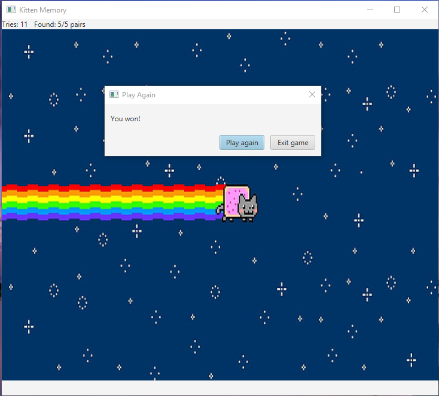
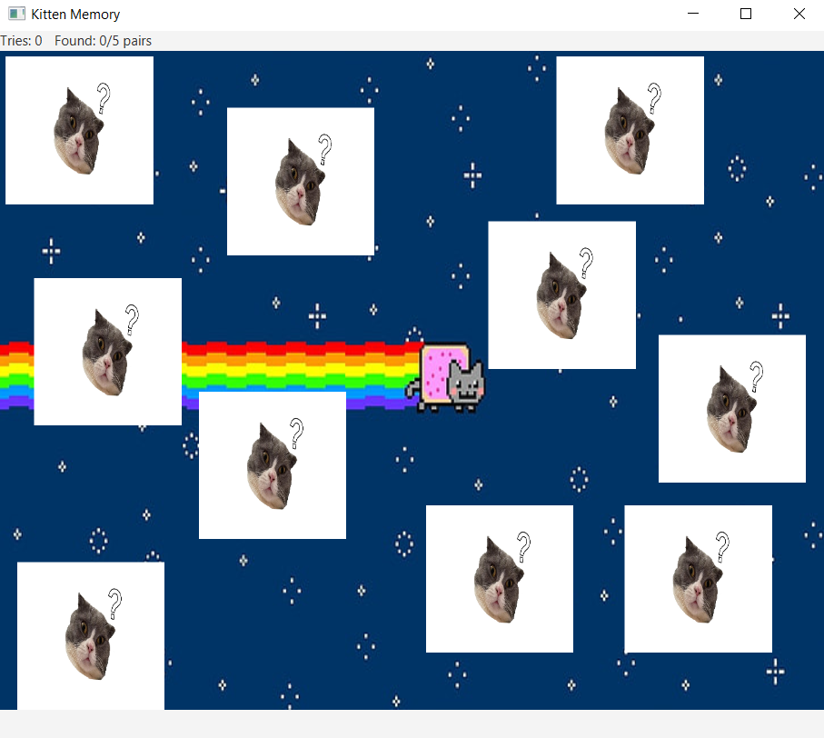
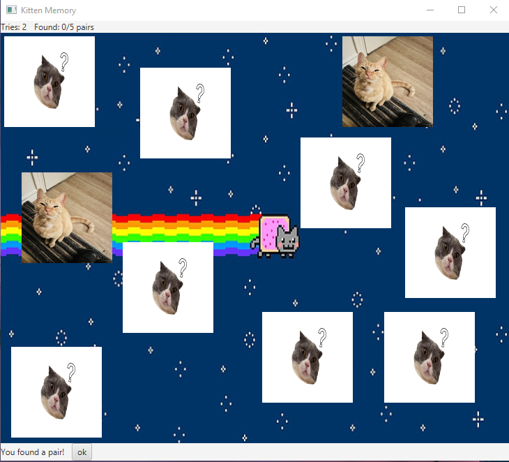
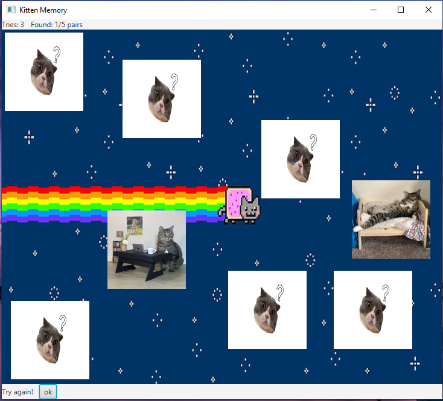

# Kitten Memory

A small one player memory game made with JavaFx.

## How to Win

The goal is to remove all tiles to win the game.

## How to Play

An even number of tiles are shuffled and flipped upside down.
The goal is to remove all tiles to win the game.
To remove tiles, you want to find pairs.
Click on a tile to flip it. If the next tile you flip have the same image. You have found a pair and they will be removed from the board.

If they don't match, the flipped tiles will turn upside down and you will have to try again.

